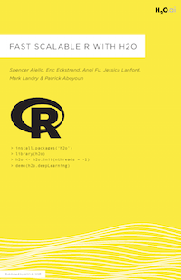

<style>
.footer {
    color: black; background: #E8E8E8;
    position: fixed; bottom: 10%;
    text-align: left; width:100%;
}
</style>
<footer class="footer">@geraudster</footer>

DeepLearning with H2O and R
========================================================
autosize: true
#subtitle: Lightning Talk
author: Géraud Dugé de Bernonville
#job: Java & Big Data Consultant
#license: by-sa
#todo: 13 diapos

@geraudster

Consultant Java & Big Data @ Valtech

Ateliers R Toulouse Data Science

Compétitions drivendata, kaggle, datascience.net

Deep Learning
========================================================

Réseau de neurone

Deep == Plusieurs couches
***


Les typologies de réseau
========================================================

Supervisé: 

* Deep Belief Network
* CNN = Convolutional
* RNN = Recurrent

Non supervisé:

* autoencoder


***


H2O
========================================================

Outil pour l'analyse de données:

* algorithmes de Machine Learning
* deep learning
* distribué, multi-threadé

Open-source

Cas d'utilisation
========================================================

* DrivenData.org
* Prédiction de l'état des pompes à eau à Tanzanie
* ... _description des données_


Application avec R
========================================================

Initialisation d'un cluster local:

```r
library(h2o)
localH2O <- h2o.init(min_mem_size = '5G', nthreads = 4)
```

Chargement des données:

```r
trainset.hex <- h2o.uploadFile(path = '~/projects/pumpprediction/trainset_values.csv',
                               destination_frame = 'trainset.hex',
                               sep = ',', header = TRUE)
```

Première version
========================================================

Utilisation des paramètres par défaut (2 couches de 200 neurones):


Nouvelles tentatives
========================================================

Test avec plusieurs paramètres + plot

Tuning des hyper-paramètres
========================================================

h2o.grid

Mise en production du modèle
========================================================

Pour en savoir plus
========================================================

http://h2o.ai


***


Creds
========================================================

By Glosser.ca - Own work, Derivative of File:Artificial neural network.svg, CC BY-SA 3.0, https://commons.wikimedia.org/w/index.php?curid=24913461

By Aphex34 - Own work, CC BY-SA 4.0, https://commons.wikimedia.org/w/index.php?curid=45679374

By Headlessplatter (talk) (Uploads) - (Original text: ''Headlessplatter (talk) (Uploads) - I made this image myself and I gift it to the public domain.), Public Domain, https://commons.wikimedia.org/w/index.php?curid=39753116

By Chervinskii - Own work, CC BY-SA 4.0, https://commons.wikimedia.org/w/index.php?curid=45555552
