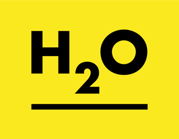

## Pump it up with H2O and R

This post will describe how to use R and H2O to obtain a not that bad score in a DrivenData challenge.

[DrivenData](http://www.drivendata.org) is a site that provides interesting data science competitions to
« Save the world ». One of those competitions is called [Pump it Up: Data Mining the Water Table](http://www.drivendata.org/competitions/7/page/23/) and aims at predicting Tanzanian water pump health.

Given data from Taarifa and the Tanzanian Ministry of Water, you have to predict the status of pump station
and tell whether they are functional, non functional or if they need repair.

First, we will see how data looks like, then we will focus on using H2O, and finally we'll train our first random forest.

## Data codebook

Let's load the data in R and see how it looks like:
```{r}
trainset.values <- read.csv('trainset_values.csv')
trainset.labels <- read.csv('trainset_labels.csv')
testset.values <- read.csv('testset_values.csv')
```

The dataset contains `r nrow(trainset.values)` observations caracterized by `r ncol(trainset.values)` variables.
Below is a sample:
```{r}
str(trainset.values)
```

Now let's see the data repartition depending on the label to be predicted (functional, non functional, need repairs):
```{r, echo = FALSE, warning = FALSE, message = FALSE, cache = TRUE, fig.width=10}
library(ggplot2)
library(gridExtra)
boxplots <- qplot(trainset.labels$status_group, 
                  fill = trainset.labels$status_group) +
  xlab('Status') +
  scale_fill_manual(values=c("green", "orange", "red"), 
                     name="Status") +
  ylab('Count') +
  ggtitle('Water pump status') +
  theme(legend.position="none")

library(plyr)
library(ggmap)
filtered.data <- join(trainset.values, trainset.labels)
filtered.data <- subset(filtered.data, longitude != 0)
bbox <- make_bbox(longitude, latitude, data = filtered.data)
map <- get_map(bbox, source = 'osm')
plot.map <- ggmap(map)
# map <- map + stat_density2d(aes(x=longitude, y=latitude, fill = ..level.., alpha = ..level.., colour = status_group),
#                             data = filtered.data,
#                             size = 0.01, bins = 16, geom = "polygon")
plot.map <- plot.map + geom_point(aes(x=longitude, y=latitude, color=status_group), data = filtered.data) +
  scale_color_manual(values=c("green", "orange", "red"), 
                     name="Status")
grid.arrange(boxplots, plot.map, nrow = 1, ncol = 2, widths = c(1,2))
```

Here we can see two things:

* first, classes are imbalanced, there are far less 'need repair' than other classes
* second, the map seems to indicate that geographic position has an importance on the pump status

Those issues are main concerns to achieve a high score, we will ignore those points at the moment and
rather create a first model as simple as possible.

## H2O

```{r, out.width = 200, fig.retina = NULL, echo = FALSE}

```

[H2O](http://h2o.ai) is an open-source tool that provides easy way to apply math and predictive 
analytics. It can work on top of Hadoop and Spark and provides nice APIs so you can use it
from several languages like Java, Python and *R* (and even Microsoft Excel!).

Here we will describe:

 * how to install H2O from R
 * perform data manipulation
 * train a random forest

### H2O Installation from R

#### Pre-requisites

* R
* Java: JRE at least 1.6 (1.7 recommended)

The following command will install the latest version of H2O:
```{r, eval = FALSE}
install.packages("h2o", type = "source", repos = (c("http://h2o-release.s3.amazonaws.com/h2o/rel-tibshirani/8/R")))
```

#### Your first instance

Starting a local instance is quite simple:
```{r, cache = TRUE}
library(h2o)
localH2O <- h2o.init()
```

You can also configure some extra parameters like RAM, thread number:
```{r, eval = FALSE}
localH2O <- h2o.init(nthreads = 12, max_mem_size = '24G')
```

This will start a local instance running on 12 threads and 24GB RAM. There are also option to connect on remote cluster.

## Data Manipulation

### Loading data into H2O

H2O package provides function to import data from CSV files. Here we will load our trainset variables and labels:

```{r, cache = TRUE}
trainset.hex <- h2o.uploadFile(path = 'trainset_values.csv', destination_frame = 'trainset.hex', sep = ',', header = TRUE)
labels.hex <- h2o.uploadFile(path = 'trainset_labels.csv', destination_frame = 'labels.hex', sep = ',', header = TRUE)

```

Data should be loaded in H2O now, we can try a few commands to see it :

```{r, eval = FALSE}
head(trainset.hex))
```

```{r, cache = TRUE, echo = FALSE}
# Render table
library(knitr)

kable(head(trainset.hex))
```

### Manipulation

We have loaded data as two separate datasets:

 * **trainset.hex**: contains variables
 * **labels.hex**: contains... labels (functional, non functional, or need repair)

It could be useful to have all in one dataset, we can do this with **h2o.merge**:
 
```{r, cache = TRUE}
trainsetFull.hex <- h2o.merge(trainset.hex, labels.hex)

# Check columns
colnames(trainsetFull.hex)
```

Great! We can see the new column *status_group*.

You can use standard operators like **$** or **[** to access the dataframe.
For instance, you can get summary of one specifc column:

```{r, cache = TRUE}
summary(trainsetFull.hex$status_group)
```


### Machine Learning

Let's split the data to validate our model:
```{r, cache = TRUE}
splits <- h2o.splitFrame(trainsetFull.hex, 0.8)
train <- splits[[1]]
test <- splits[[2]]

dim(train)
dim(test)
```

Now we'll check label proportion:
```{r, cache = TRUE}
prop.table(table(as.vector(train$status_group)))
prop.table(table(as.vector(test$status_group)))
```


We will restrict the list of predictors as some nominal values contain lots of categories ('wpt_name', 'subvillage', 'scheme_name', 'installer', 'ward', 'funder'):

```{r, cache = TRUE}
allVariables <- colnames(train)
predictors <- colnames(train)[!(allVariables %in% c('id', 'wpt_name', 'subvillage', 'scheme_name', 'installer', 'ward', 'funder', 'status_group', 'recorded_by'))]
```


Now we are going to train our random forest on the dataset:

```{r, cache = TRUE}
rfModel <- h2o.randomForest(predictors, 'status_group', train)
```

Let's validate it:
```{r, cache = TRUE}
confusionMatrix <- h2o.confusionMatrix(rfModel, newdata = test)

kable(confusionMatrix) # kable is a knitr function to display beautiful tables
```


### Results

We ended with a quite good model with around 80% accuracy. Applying this model to
the submission dataset, you should obtain a similar score.

But what we also see here is that *needs repair* predictions are quite bad (error rate near 70%).
That's another difficulty encountered in this competition that we will not address here!

### Shutting down

Now that we finished our analysis, we can shutdown the H2O cluster:

```{r, cache = TRUE}
h2o.shutdown(prompt = FALSE)
```


